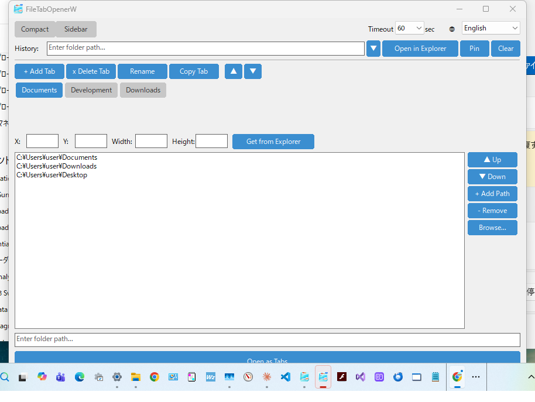
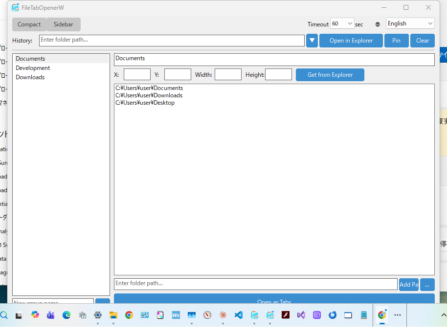

# FileTabOpenerW

[日本語](README_ja.md) | [한국어](README_ko.md) | [繁體中文](README_zh_TW.md) | [简体中文](README_zh_CN.md)

A native C++ Win32 application for managing and opening folders as Explorer tabs on Windows 11+.

This is the Windows-native port of [file_tab_opener](https://github.com/obott9/file_tab_opener) (Python/Tk), built with pure Win32 API for minimal dependencies and fast startup.

## Features

- **Tab Group Management** - Create, rename, copy, delete, and reorder tab groups. Copy names follow `"{base} {N}"` pattern: "Work" → "Work 1" → "Work 2"
- **One-Click Open** - Open all folders in a tab group as Explorer tabs in a single window
- **Dual Layout** - Compact layout (default, tab button bar) and Sidebar layout (ListView + detail panel); Sidebar layout ported from the macOS SwiftUI version
- **Folder History** - Recently opened folders with pin support
- **Window Geometry** - Save and restore Explorer window position/size per tab group
- **Multi-Monitor** - Supports negative coordinates for multi-monitor setups
- **Dark Mode** - Follows Windows dark/light theme automatically
- **Single Instance** - Only one instance runs at a time; second launch brings existing window to foreground
- **Internationalization** - English, Japanese, Korean, Traditional/Simplified Chinese
- **Network Path Support** - UNC paths (`\\server\share`) can be registered even when offline; Explorer handles authentication on open
- **Portable Config** - JSON configuration file in `%APPDATA%\FileTabOpenerW`

## Screenshots

| Compact Layout | Sidebar Layout |
|:-:|:-:|
|  |  |

## Download

Download the latest `.exe` from [GitHub Releases](https://github.com/obott9/FileTabOpenerW/releases).

> **Note:** This app is not code-signed. On first launch, Windows SmartScreen may show a warning. Click "More info" then "Run anyway" to proceed.

## Requirements

- Windows 11 or later (Windows 10 may work but Explorer tab support requires Win11 22H2+)
- MSVC build tools (Visual Studio 2019+ or Build Tools for Visual Studio)
- CMake 3.20+

## Build

### VS Code (Recommended)

1. Install the [CMake Tools](https://marketplace.visualstudio.com/items?itemName=ms-vscode.cmake-tools) extension
2. Select **CMake: [Release]** from the status bar
3. Select build target **[FileTabOpenerW]** from the status bar
4. Click the **Build** button in the status bar (or `Ctrl+Shift+B`)

### Command Line

```bash
mkdir build && cd build
cmake .. -G "Visual Studio 17 2022"
cmake --build . --config Release
```

The executable will be at `build/Release/FileTabOpenerW.exe`.

## Usage

1. Launch `FileTabOpenerW.exe`
2. Create a tab group with **+ Add Tab**
3. Add folder paths using the path entry field or **Browse...**
4. Optionally set Explorer window geometry with **Get from Explorer**
5. Click **Open as Tabs** to open all folders as tabs in one Explorer window

### How It Works

The application uses a multi-strategy approach to open Explorer tabs:

1. **UI Automation (UIA)** - Primary method. Uses the Windows UI Automation API to find the Explorer's "New Tab" button and address bar, then programmatically creates tabs and navigates to each path. Uses PostMessage for Enter key (window-targeted, not global).
2. **SendInput** - Fallback. Uses OS-level keystroke simulation (Ctrl+T, Ctrl+L, path typing, Enter). Less reliable due to focus and timing issues.
3. **Separate Windows** - Last resort. Opens each folder in its own Explorer window.

### Network Paths

UNC paths (`\\server\share`) are supported. Since network shares may require authentication that only Explorer can trigger, UNC paths skip the usual directory existence validation and are passed directly to Explorer.

When a UNC path requires authentication:
1. Explorer shows a Windows Security credential dialog
2. The app continues opening remaining tabs without waiting for authentication
3. The tab initially shows "This PC" as a placeholder
4. After the user authenticates, Explorer navigates to the actual network share

If the user cancels the authentication dialog, the tab remains on "This PC".

### Performance Note

Windows Explorer does not provide a public API for tab operations. All methods rely on UI Automation or keystroke simulation, which requires delays between each tab for the UI to respond. Opening many tabs will be noticeably slower than expected.

> **Important (SendInput fallback):** Do not use the keyboard or mouse while tabs are being opened. The SendInput method uses OS-level keystroke simulation, so any input during the operation may interfere with the automation. The UIA method primarily uses targeted UI Automation and PostMessage (no global keystrokes), but may fall back to keyboard input when a UIA operation fails.

## Configuration

Configuration is stored in JSON format:

- **Windows**: `%APPDATA%\FileTabOpenerW\config.json`

The config file is compatible with the Python version (file_tab_opener).

## Logging

Logs are written to `%APPDATA%\FileTabOpenerW\debug.log`. Log files are rotated by size (1 MB, up to 3 backups).

## Project Structure

```
FileTabOpenerW/
  CMakeLists.txt
  src/
    main.cpp              # Entry point
    app.h/cpp             # Application lifecycle, dark mode detection
    config.h/cpp          # JSON configuration (nlohmann/json)
    main_window.h/cpp     # Main window with settings bar
    history_section.h/cpp # Folder history with dropdown
    tab_group_section.h/cpp # Tab group management UI (Compact layout)
    modern_tab_group_section.h/cpp # Sidebar layout (ListView + detail panel)
    tab_view.h/cpp        # Custom tab button bar with scrolling
    theme.h               # Color theme constants
    input_dialog.h/cpp    # Modal input dialog
    explorer_opener.h/cpp # Explorer tab automation (UIA/SendInput)
    i18n.h/cpp            # Internationalization
    utils.h/cpp           # String conversion, path utilities
    logger.h/cpp          # File logger
  res/
    resource.h            # Resource IDs
    app.rc                # Version info, manifest
    app.manifest          # Common controls v6, DPI awareness
  include/
    nlohmann/json.hpp     # JSON library (header-only)
```

## Author

[obott9](https://github.com/obott9)

## Related Projects

- **[file_tab_opener](https://github.com/obott9/file_tab_opener)** — Cross-platform version (Python/Tk). macOS & Windows support.
- **[FileTabOpenerM](https://github.com/obott9/FileTabOpenerM)** — macOS native version (Swift/SwiftUI). AX API + AppleScript hybrid for reliable Finder tab control.

## Development

This project was developed in collaboration with Anthropic's **Claude AI**.
Claude assisted with:
* Architecture design and code implementation
* Multi-language localization
* Documentation and README creation

## Support

If you find this app useful, please give it a star on GitHub!

[](https://github.com/obott9/FileTabOpenerW)

You can also buy me a coffee or become a sponsor!

[](https://github.com/sponsors/obott9)
[](https://buymeacoffee.com/obott9)

## License

[MIT License](LICENSE)
