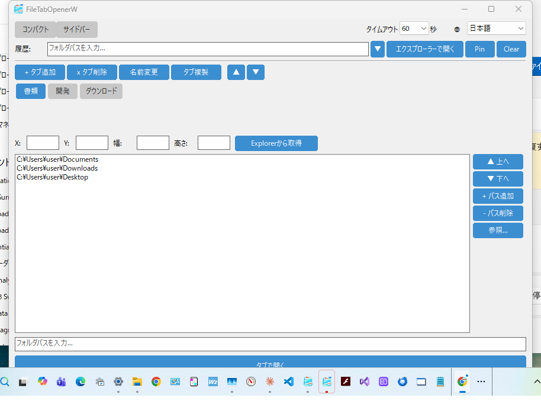
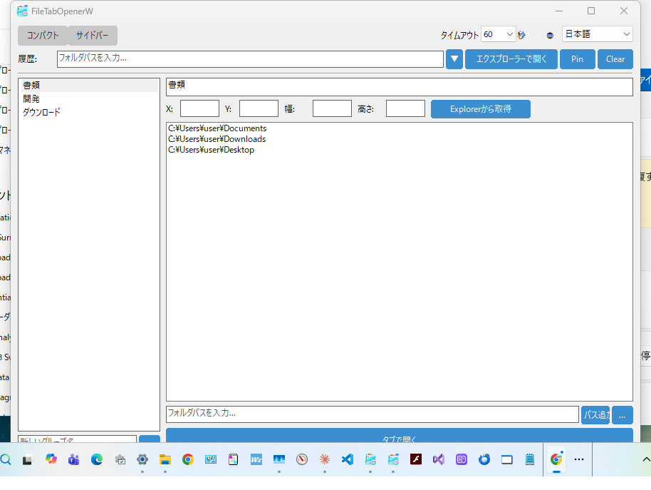

# FileTabOpenerW

[English](README.md) | [한국어](README_ko.md) | [繁體中文](README_zh_TW.md) | [简体中文](README_zh_CN.md)

Windows 11+ のエクスプローラーでフォルダをタブとして開くためのネイティブ C++ Win32 アプリケーションです。

[file_tab_opener](https://github.com/obott9/file_tab_opener) (Python/Tk) の Windows ネイティブ移植版で、純粋な Win32 API で構築されており、依存関係が少なく高速に起動します。

## 機能

- **タブグループ管理** - タブグループの作成、名前変更、コピー、削除、並べ替え
- **ワンクリックオープン** - タブグループ内の全フォルダを1つのエクスプローラーウィンドウでタブとして開く
- **デュアルレイアウト** - コンパクトレイアウト（タブボタンバー）とサイドバーレイアウト（ListView＋詳細パネル）をトグルで切替
- **フォルダ履歴** - 最近開いたフォルダの履歴（ピン留め対応）
- **ウィンドウジオメトリ** - タブグループごとにエクスプローラーの位置・サイズを保存・復元
- **マルチモニター** - マルチモニター環境の負の座標に対応
- **ダークモード** - Windows のダーク/ライトテーマに自動追従
- **シングルインスタンス** - 同時に1つのインスタンスのみ実行。2回目の起動で既存ウィンドウがフォアグラウンドに
- **多言語対応** - 英語、日本語、韓国語、繁体字/簡体字中国語
- **ポータブル設定** - `%APPDATA%\FileTabOpenerW` に JSON 設定ファイル

## スクリーンショット

| コンパクトレイアウト | サイドバーレイアウト |
|:-:|:-:|
|  |  |

## ダウンロード

最新の `.exe` は [GitHub Releases](https://github.com/obott9/FileTabOpenerW/releases) からダウンロードできます。

> **注意:** このアプリはコード署名されていません。初回起動時に Windows SmartScreen が警告を表示する場合があります。「詳細情報」→「実行」をクリックしてください。

## 動作要件

- Windows 11 以降（Windows 10 でも動作する可能性がありますが、エクスプローラーのタブ機能は Win11 22H2+ が必要）
- MSVC ビルドツール（Visual Studio 2019+ または Build Tools for Visual Studio）
- CMake 3.20+

## ビルド

```bash
mkdir build && cd build
cmake .. -G "Visual Studio 17 2022"
cmake --build . --config Release
```

実行ファイルは `build/Release/FileTabOpenerW.exe` に生成されます。

## 使い方

1. `FileTabOpenerW.exe` を起動
2. **+ タブ追加** でタブグループを作成
3. パス入力欄または **参照...** でフォルダパスを追加
4. 必要に応じて **Explorerから取得** でウィンドウジオメトリを設定
5. **タブで開く** をクリックして全フォルダをエクスプローラーのタブとして開く

### 仕組み

アプリケーションはエクスプローラーのタブを開くために複数の戦略を使用します：

1. **UI Automation (UIA)** - 主要な方法。Windows UI Automation API を使用してエクスプローラーの「新しいタブ」ボタンとアドレスバーを検出し、プログラムでタブを作成してパスに移動します。
2. **SendInput** - フォールバック。Ctrl+T（新しいタブ）、Ctrl+L（アドレスバーフォーカス）をシミュレートし、パスを入力して Enter を押します。
3. **個別ウィンドウ** - 最終手段。各フォルダを個別のエクスプローラーウィンドウで開きます。

## 設定ファイル

設定は JSON 形式で保存されます：

- **Windows**: `%APPDATA%\FileTabOpenerW\config.json`

設定ファイルは Python 版 (file_tab_opener) と互換性があります。

## ログ

ログは `%APPDATA%\FileTabOpenerW\debug.log` に出力されます。ログファイルはサイズベースでローテーションされます（1 MB、最大3世代）。

## プロジェクト構成

```
FileTabOpenerW/
  CMakeLists.txt
  src/
    main.cpp              # エントリーポイント
    app.h/cpp             # アプリケーションライフサイクル、ダークモード検出
    config.h/cpp          # JSON 設定 (nlohmann/json)
    main_window.h/cpp     # メインウィンドウ（設定バー付き）
    history_section.h/cpp # フォルダ履歴（ドロップダウン付き）
    tab_group_section.h/cpp # タブグループ管理 UI（コンパクトレイアウト）
    modern_tab_group_section.h/cpp # サイドバーレイアウト（ListView＋詳細パネル）
    tab_view.h/cpp        # カスタムタブボタンバー（スクロール対応）
    theme.h               # カラーテーマ定数
    input_dialog.h/cpp    # モーダル入力ダイアログ
    explorer_opener.h/cpp # エクスプローラータブ自動化 (UIA/SendInput)
    i18n.h/cpp            # 多言語対応
    utils.h/cpp           # 文字列変換、パスユーティリティ
    logger.h/cpp          # ファイルロガー
  res/
    resource.h            # リソース ID
    app.rc                # バージョン情報、マニフェスト
    app.manifest          # Common Controls v6、DPI 対応
  include/
    nlohmann/json.hpp     # JSON ライブラリ（ヘッダオンリー）
```

## 著作者

[obott9](https://github.com/obott9)

## 関連プロジェクト

- **[file_tab_opener](https://github.com/obott9/file_tab_opener)** — クロスプラットフォーム版（Python/Tk）。macOS & Windows 対応。
- **[FileTabOpenerM](https://github.com/obott9/FileTabOpenerM)** — macOS ネイティブ版（Swift/SwiftUI）。AX API + AppleScript ハイブリッドで Finder タブを確実に制御。

## 開発

このプロジェクトは Anthropic の **Claude AI** との共同作業で開発されました。
Claude は以下をサポートしました：
* アーキテクチャ設計とコード実装
* 多言語ローカライズ
* ドキュメントと README の作成

## サポート

このアプリが役に立ったら、GitHub でスターを押してください！

[](https://github.com/obott9/FileTabOpenerW)

コーヒーをおごったり、スポンサーになっていただけると励みになります！

[](https://github.com/sponsors/obott9)
[](https://buymeacoffee.com/obott9)

## ライセンス

[MIT License](LICENSE)
