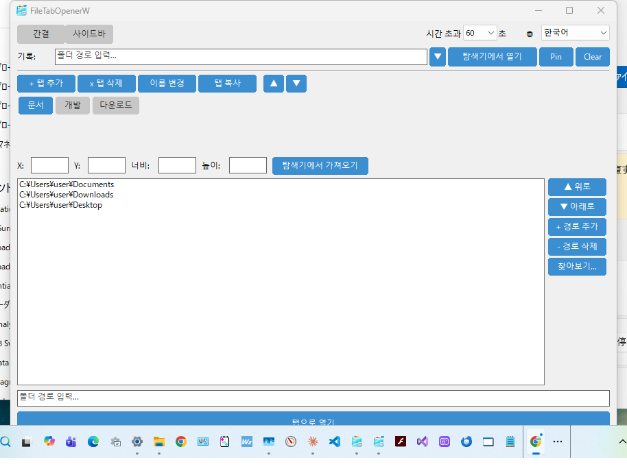
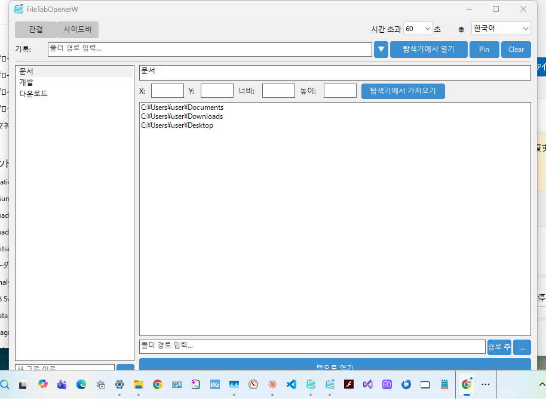

# FileTabOpenerW

[English](README.md) | [日本語](README_ja.md) | [繁體中文](README_zh_TW.md) | [简体中文](README_zh_CN.md)

Windows 11+의 파일 탐색기에서 폴더를 탭으로 열기 위한 네이티브 C++ Win32 애플리케이션입니다.

[file_tab_opener](https://github.com/obott9/file_tab_opener) (Python/Tk)의 Windows 네이티브 포팅 버전으로, 순수 Win32 API로 구축되어 의존성이 적고 빠르게 시작됩니다.

## 기능

- **탭 그룹 관리** - 탭 그룹 생성, 이름 변경, 복사, 삭제, 정렬. 복사 이름은 `"{기본명} {N}"` 패턴: "작업" → "작업 1" → "작업 2"
- **원클릭 열기** - 탭 그룹의 모든 폴더를 하나의 파일 탐색기 창에서 탭으로 열기
- **듀얼 레이아웃** - 컴팩트 레이아웃(기본, 탭 버튼 바)과 사이드바 레이아웃(ListView + 상세 패널). 사이드바 레이아웃은 macOS SwiftUI 버전에서 이식
- **폴더 기록** - 최근 연 폴더 기록 (고정 지원)
- **창 지오메트리** - 탭 그룹별 파일 탐색기 위치/크기 저장 및 복원
- **멀티 모니터** - 멀티 모니터 환경의 음수 좌표 지원
- **다크 모드** - Windows 다크/라이트 테마 자동 추종
- **싱글 인스턴스** - 한 번에 하나의 인스턴스만 실행. 두 번째 실행 시 기존 창이 전면으로
- **다국어 지원** - 영어, 일본어, 한국어, 번체/간체 중국어
- **네트워크 경로 지원** - UNC 경로 (`\\server\share`)는 오프라인에서도 등록 가능. 인증이 필요한 경우 파일 탐색기가 인증 대화 상자를 표시
- **포터블 설정** - `%APPDATA%\FileTabOpenerW`에 JSON 설정 파일

## 스크린샷

| 컴팩트 레이아웃 | 사이드바 레이아웃 |
|:-:|:-:|
|  |  |

## 다운로드

최신 `.exe`는 [GitHub Releases](https://github.com/obott9/FileTabOpenerW/releases)에서 다운로드할 수 있습니다.

> **참고:** 이 앱은 코드 서명되지 않았습니다. 첫 실행 시 Windows SmartScreen이 경고를 표시할 수 있습니다. "자세한 정보" → "실행"을 클릭하세요.

## 시스템 요구 사항

- Windows 11 이상 (Windows 10에서도 동작할 수 있으나, 파일 탐색기 탭 기능은 Win11 22H2+ 필요)
- MSVC 빌드 도구 (Visual Studio 2019+ 또는 Build Tools for Visual Studio)
- CMake 3.20+

## 빌드

### VS Code (권장)

1. [CMake Tools](https://marketplace.visualstudio.com/items?itemName=ms-vscode.cmake-tools) 확장 프로그램 설치
2. 상태 표시줄에서 **CMake: [Release]** 선택
3. 상태 표시줄에서 빌드 대상 **[FileTabOpenerW]** 선택
4. 상태 표시줄의 **빌드** 버튼 클릭 (또는 `Ctrl+Shift+B`)

### 명령줄

```bash
mkdir build && cd build
cmake .. -G "Visual Studio 17 2022"
cmake --build . --config Release
```

실행 파일은 `build/Release/FileTabOpenerW.exe`에 생성됩니다.

## 사용법

1. `FileTabOpenerW.exe` 실행
2. **+ 탭 추가**로 탭 그룹 생성
3. 경로 입력란 또는 **찾아보기...**로 폴더 경로 추가
4. 필요에 따라 **탐색기에서 가져오기**로 창 지오메트리 설정
5. **탭으로 열기**를 클릭하여 모든 폴더를 파일 탐색기 탭으로 열기

### 작동 방식

애플리케이션은 파일 탐색기 탭을 열기 위해 여러 전략을 사용합니다:

1. **UI Automation (UIA)** - 주요 방법. Windows UI Automation API를 사용하여 파일 탐색기의 "새 탭" 버튼과 주소 표시줄을 찾아 프로그래밍 방식으로 탭을 생성하고 경로를 이동합니다. Enter 키는 PostMessage로 창에 직접 전송 (글로벌 키스트로크 아님).
2. **SendInput** - 대체 방법. OS 수준의 키스트로크 시뮬레이션 (Ctrl+T, Ctrl+L, 경로 입력, Enter). 포커스 및 타이밍 문제로 신뢰성이 떨어질 수 있습니다.
3. **개별 창** - 최후 수단. 각 폴더를 개별 파일 탐색기 창으로 엽니다.

### 네트워크 경로

UNC 경로 (`\\server\share`)를 지원합니다. 네트워크 공유는 인증이 필요할 수 있으므로, UNC 경로는 일반적인 디렉토리 존재 확인을 건너뛰고 파일 탐색기에 직접 전달됩니다.

인증이 필요한 UNC 경로의 경우:
1. 파일 탐색기가 Windows 보안 자격 증명 대화 상자를 표시
2. 앱은 인증을 기다리지 않고 나머지 탭을 계속 열기
3. 탭이 일시적으로 "내 PC"를 표시
4. 사용자 인증 후, 파일 탐색기가 실제 네트워크 공유로 이동

사용자가 인증 대화 상자를 취소하면 탭은 "내 PC"에 남습니다.

### 성능 관련 참고사항

Windows 파일 탐색기에는 탭 조작용 공개 API가 없습니다. 모든 방법은 UI Automation 또는 키스트로크 시뮬레이션에 의존하며, UI가 응답할 때까지 각 탭 사이에 대기가 필요합니다. 많은 탭을 여는 경우 예상보다 느릴 수 있습니다.

> **중요 (SendInput 대체 방법):** 탭을 여는 동안 키보드나 마우스를 사용하지 마세요. SendInput 방법은 OS 수준의 키스트로크 시뮬레이션을 사용하므로, 조작 중 입력이 자동화를 방해할 수 있습니다. UIA 방법은 주로 대상 지정 UI Automation과 PostMessage를 사용하지만 (글로벌 키스트로크 없음), UIA 조작 실패 시 키보드 입력으로 대체될 수 있습니다.

## 설정

설정은 JSON 형식으로 저장됩니다:

- **Windows**: `%APPDATA%\FileTabOpenerW\config.json`

설정 파일은 Python 버전 (file_tab_opener)과 호환됩니다.

## 로그

로그는 `%APPDATA%\FileTabOpenerW\debug.log`에 출력됩니다. 로그 파일은 크기 기반으로 로테이션됩니다 (1 MB, 최대 3세대).

## 프로젝트 구조

```
FileTabOpenerW/
  CMakeLists.txt
  src/
    main.cpp              # 진입점
    app.h/cpp             # 애플리케이션 라이프사이클, 다크 모드 감지
    config.h/cpp          # JSON 설정 (nlohmann/json)
    main_window.h/cpp     # 메인 창 (설정 바 포함)
    history_section.h/cpp # 폴더 기록 (드롭다운 포함)
    tab_group_section.h/cpp # 탭 그룹 관리 UI (컴팩트 레이아웃)
    modern_tab_group_section.h/cpp # 사이드바 레이아웃 (ListView + 상세 패널)
    tab_view.h/cpp        # 커스텀 탭 버튼 바 (스크롤 지원)
    theme.h               # 색상 테마 상수
    input_dialog.h/cpp    # 모달 입력 대화 상자
    explorer_opener.h/cpp # 파일 탐색기 탭 자동화 (UIA/SendInput)
    i18n.h/cpp            # 다국어 지원
    utils.h/cpp           # 문자열 변환, 경로 유틸리티
    logger.h/cpp          # 파일 로거
  res/
    resource.h            # 리소스 ID
    app.rc                # 버전 정보, 매니페스트
    app.manifest          # Common Controls v6, DPI 인식
  include/
    nlohmann/json.hpp     # JSON 라이브러리 (헤더 전용)
```

## 작성자

[obott9](https://github.com/obott9)

## 관련 프로젝트

- **[file_tab_opener](https://github.com/obott9/file_tab_opener)** — 크로스 플랫폼 버전 (Python/Tk). macOS & Windows 지원.
- **[FileTabOpenerM](https://github.com/obott9/FileTabOpenerM)** — macOS 네이티브 버전 (Swift/SwiftUI). AX API + AppleScript 하이브리드로 Finder 탭 제어.

## 개발

이 프로젝트는 Anthropic의 **Claude AI**와의 공동 작업으로 개발되었습니다.
Claude는 다음을 지원했습니다:
* 아키텍처 설계 및 코드 구현
* 다국어 로컬라이제이션
* 문서 및 README 작성

## 서포트

이 앱이 유용하다고 생각하시면 GitHub에서 스타를 눌러주세요!

[](https://github.com/obott9/FileTabOpenerW)

커피 한 잔 사주시거나 스폰서가 되어 주시면 큰 힘이 됩니다!

[](https://github.com/sponsors/obott9)
[](https://buymeacoffee.com/obott9)

## 라이선스

[MIT License](LICENSE)
