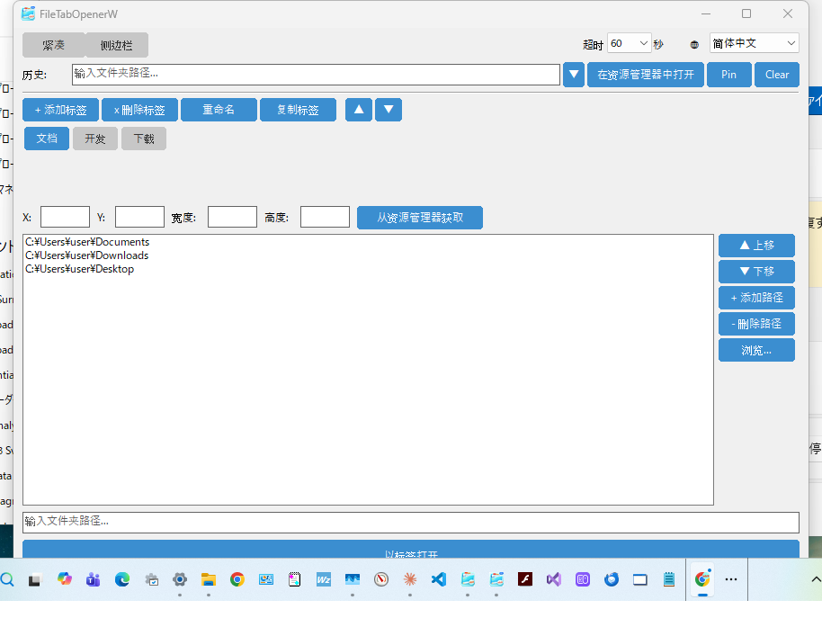
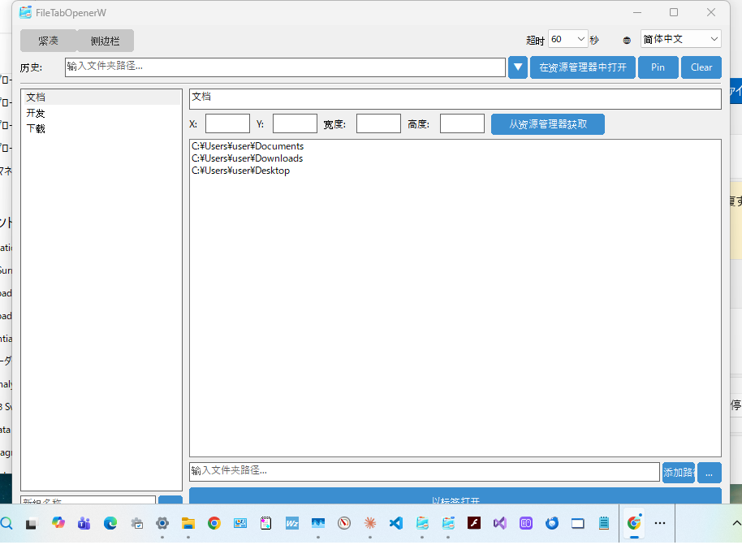

# FileTabOpenerW

[English](README.md) | [日本語](README_ja.md) | [한국어](README_ko.md) | [繁體中文](README_zh_TW.md)

用于在 Windows 11+ 的资源管理器中以标签页方式打开文件夹的原生 C++ Win32 应用程序。

这是 [file_tab_opener](https://github.com/obott9/file_tab_opener) (Python/Tk) 的 Windows 原生移植版，使用纯 Win32 API 构建，依赖少，启动速度快。

## 功能

- **标签组管理** - 创建、重命名、复制、删除及排序标签组
- **一键打开** - 将标签组中的所有文件夹在一个资源管理器窗口中以标签页方式打开
- **双布局** - 紧凑布局（标签按钮栏）与侧边栏布局（ListView + 详细面板）切换
- **文件夹历史** - 最近打开的文件夹记录（支持固定）
- **窗口位置** - 按标签组保存及恢复资源管理器的位置和大小
- **多显示器** - 支持多显示器环境的负坐标
- **深色模式** - 自动跟随 Windows 深色/浅色主题
- **单实例** - 同时只运行一个实例。第二次启动会将现有窗口带到前台
- **多语言支持** - 英语、日语、韩语、繁体/简体中文
- **便携式配置** - JSON 配置文件位于 `%APPDATA%\FileTabOpenerW`

## 截图

| 紧凑布局 | 侧边栏布局 |
|:-:|:-:|
|  |  |

## 下载

从 [GitHub Releases](https://github.com/obott9/FileTabOpenerW/releases) 下载最新的 `.exe`。

> **注意：** 此应用未经代码签名。首次启动时，Windows SmartScreen 可能会显示警告。请点击"更多信息"→"仍要运行"。

## 系统要求

- Windows 11 或更高版本（Windows 10 可能可以运行，但资源管理器标签页功能需要 Win11 22H2+）
- MSVC 构建工具（Visual Studio 2019+ 或 Build Tools for Visual Studio）
- CMake 3.20+

## 构建

```bash
mkdir build && cd build
cmake .. -G "Visual Studio 17 2022"
cmake --build . --config Release
```

可执行文件将生成于 `build/Release/FileTabOpenerW.exe`。

## 使用方法

1. 启动 `FileTabOpenerW.exe`
2. 使用 **+ 添加标签** 创建标签组
3. 通过路径输入栏或 **浏览...** 添加文件夹路径
4. 根据需要使用 **从资源管理器获取** 设置窗口位置
5. 点击 **以标签打开** 将所有文件夹在资源管理器中以标签页方式打开

### 工作原理

应用程序使用多种策略来打开资源管理器标签页：

1. **UI Automation (UIA)** - 主要方法。使用 Windows UI Automation API 查找资源管理器的"新建标签页"按钮和地址栏，以编程方式创建标签页并导航到各路径。
2. **SendInput** - 备用方法。模拟 Ctrl+T（新建标签页）、Ctrl+L（地址栏聚焦），输入路径后按 Enter。
3. **独立窗口** - 最后手段。以独立的资源管理器窗口打开每个文件夹。

## 配置

配置以 JSON 格式保存：

- **Windows**: `%APPDATA%\FileTabOpenerW\config.json`

配置文件与 Python 版（file_tab_opener）兼容。

## 日志

日志输出至 `%APPDATA%\FileTabOpenerW\debug.log`。日志文件按大小进行轮替（1 MB，最多 3 个备份）。

## 项目结构

```
FileTabOpenerW/
  CMakeLists.txt
  src/
    main.cpp              # 入口点
    app.h/cpp             # 应用程序生命周期、深色模式检测
    config.h/cpp          # JSON 配置 (nlohmann/json)
    main_window.h/cpp     # 主窗口（含设置栏）
    history_section.h/cpp # 文件夹历史（含下拉菜单）
    tab_group_section.h/cpp # 标签组管理 UI（紧凑布局）
    modern_tab_group_section.h/cpp # 侧边栏布局（ListView + 详细面板）
    tab_view.h/cpp        # 自定义标签按钮栏（支持滚动）
    theme.h               # 颜色主题常量
    input_dialog.h/cpp    # 模态输入对话框
    explorer_opener.h/cpp # 资源管理器标签页自动化 (UIA/SendInput)
    i18n.h/cpp            # 多语言支持
    utils.h/cpp           # 字符串转换、路径工具
    logger.h/cpp          # 文件日志器
  res/
    resource.h            # 资源 ID
    app.rc                # 版本信息、清单
    app.manifest          # Common Controls v6、DPI 感知
  include/
    nlohmann/json.hpp     # JSON 库（仅头文件）
```

## 作者

[obott9](https://github.com/obott9)

## 相关项目

- **[file_tab_opener](https://github.com/obott9/file_tab_opener)** — 跨平台版（Python/Tk）。支持 macOS 和 Windows。
- **[FileTabOpenerM](https://github.com/obott9/FileTabOpenerM)** — macOS 原生版（Swift/SwiftUI）。AX API + AppleScript 混合方式控制 Finder 标签页。

## 开发

本项目与 Anthropic 的 **Claude AI** 协作开发。
Claude 提供了以下支持：
* 架构设计与代码实现
* 多语言本地化
* 文档与 README 编写

## 支持

如果您觉得这个应用有用，请在 GitHub 上给它一颗星！

[](https://github.com/obott9/FileTabOpenerW)

[](https://github.com/sponsors/obott9)
[](https://buymeacoffee.com/obott9)

## 许可证

[MIT License](LICENSE)
