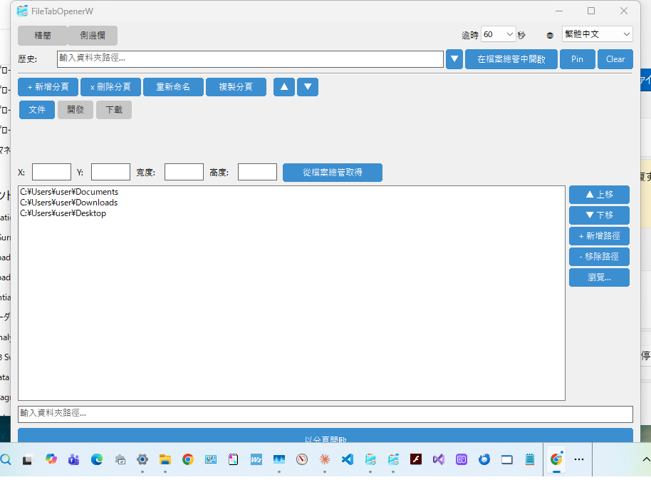
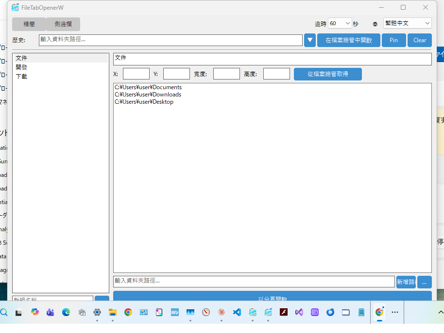

# FileTabOpenerW

[English](README.md) | [日本語](README_ja.md) | [한국어](README_ko.md) | [简体中文](README_zh_CN.md)

用於在 Windows 11+ 的檔案總管中以分頁方式開啟資料夾的原生 C++ Win32 應用程式。

這是 [file_tab_opener](https://github.com/obott9/file_tab_opener) (Python/Tk) 的 Windows 原生移植版，使用純 Win32 API 構建，依賴性少，啟動速度快。

## 功能

- **分頁群組管理** - 建立、重新命名、複製、刪除及排序分頁群組
- **一鍵開啟** - 將分頁群組中的所有資料夾在一個檔案總管視窗中以分頁方式開啟
- **雙佈局** - 精簡佈局（分頁按鈕列）與側邊欄佈局（ListView + 詳細面板）切換
- **資料夾歷史** - 最近開啟的資料夾記錄（支援釘選）
- **視窗位置** - 按分頁群組儲存及還原檔案總管的位置和大小
- **多螢幕** - 支援多螢幕環境的負座標
- **深色模式** - 自動跟隨 Windows 深色/淺色主題
- **單一執行個體** - 同時僅執行一個實例。第二次啟動會將現有視窗帶到前景
- **多語言支援** - 英語、日語、韓語、繁體/簡體中文
- **可攜式設定** - JSON 設定檔位於 `%APPDATA%\FileTabOpenerW`

## 螢幕截圖

| 精簡佈局 | 側邊欄佈局 |
|:-:|:-:|
|  |  |

## 下載

從 [GitHub Releases](https://github.com/obott9/FileTabOpenerW/releases) 下載最新的 `.exe`。

> **注意：** 此應用程式未經程式碼簽章。首次啟動時，Windows SmartScreen 可能會顯示警告。請點擊「更多資訊」→「仍要執行」。

## 系統需求

- Windows 11 或更新版本（Windows 10 可能可以運行，但檔案總管分頁功能需要 Win11 22H2+）
- MSVC 建置工具（Visual Studio 2019+ 或 Build Tools for Visual Studio）
- CMake 3.20+

## 建置

### VS Code（建議）

1. 安裝 [CMake Tools](https://marketplace.visualstudio.com/items?itemName=ms-vscode.cmake-tools) 擴充功能
2. 在狀態列選擇 **CMake: [Release]**
3. 在狀態列選擇建置目標 **[FileTabOpenerW]**
4. 點擊狀態列的 **建置** 按鈕（或 `Ctrl+Shift+B`）

### 命令列

```bash
mkdir build && cd build
cmake .. -G "Visual Studio 17 2022"
cmake --build . --config Release
```

執行檔將產生於 `build/Release/FileTabOpenerW.exe`。

## 使用方式

1. 啟動 `FileTabOpenerW.exe`
2. 使用 **+ 新增分頁** 建立分頁群組
3. 透過路徑輸入欄或 **瀏覽...** 新增資料夾路徑
4. 視需要使用 **從檔案總管取得** 設定視窗位置
5. 點擊 **以分頁開啟** 將所有資料夾在檔案總管中以分頁方式開啟

### 運作方式

應用程式使用多種策略來開啟檔案總管分頁：

1. **UI Automation (UIA)** - 主要方法。使用 Windows UI Automation API 尋找檔案總管的「新增分頁」按鈕和網址列，以程式方式建立分頁並導覽至各路徑。
2. **SendInput** - 備用方法。模擬 Ctrl+T（新增分頁）、Ctrl+L（網址列焦點），輸入路徑後按 Enter。
3. **個別視窗** - 最終手段。以個別檔案總管視窗開啟每個資料夾。

## 設定

設定以 JSON 格式儲存：

- **Windows**: `%APPDATA%\FileTabOpenerW\config.json`

設定檔與 Python 版（file_tab_opener）相容。

## 記錄檔

記錄檔輸出至 `%APPDATA%\FileTabOpenerW\debug.log`。記錄檔按大小進行輪替（1 MB，最多 3 個備份）。

## 專案結構

```
FileTabOpenerW/
  CMakeLists.txt
  src/
    main.cpp              # 進入點
    app.h/cpp             # 應用程式生命週期、深色模式偵測
    config.h/cpp          # JSON 設定 (nlohmann/json)
    main_window.h/cpp     # 主視窗（含設定列）
    history_section.h/cpp # 資料夾歷史（含下拉選單）
    tab_group_section.h/cpp # 分頁群組管理 UI（精簡佈局）
    modern_tab_group_section.h/cpp # 側邊欄佈局（ListView + 詳細面板）
    tab_view.h/cpp        # 自訂分頁按鈕列（支援捲動）
    theme.h               # 色彩主題常數
    input_dialog.h/cpp    # 模態輸入對話方塊
    explorer_opener.h/cpp # 檔案總管分頁自動化 (UIA/SendInput)
    i18n.h/cpp            # 多語言支援
    utils.h/cpp           # 字串轉換、路徑工具
    logger.h/cpp          # 檔案記錄器
  res/
    resource.h            # 資源 ID
    app.rc                # 版本資訊、資訊清單
    app.manifest          # Common Controls v6、DPI 感知
  include/
    nlohmann/json.hpp     # JSON 函式庫（僅標頭檔）
```

## 作者

[obott9](https://github.com/obott9)

## 相關專案

- **[file_tab_opener](https://github.com/obott9/file_tab_opener)** — 跨平台版（Python/Tk）。支援 macOS 與 Windows。
- **[FileTabOpenerM](https://github.com/obott9/FileTabOpenerM)** — macOS 原生版（Swift/SwiftUI）。AX API + AppleScript 混合方式控制 Finder 分頁。

## 開發

本專案與 Anthropic 的 **Claude AI** 共同開發。
Claude 提供了以下支援：
* 架構設計與程式碼實作
* 多語言在地化
* 文件與 README 撰寫

## 支持

如果您覺得這個應用程式有用，請在 GitHub 上給它一顆星！

[](https://github.com/obott9/FileTabOpenerW)

也歡迎請我喝杯咖啡或成為贊助者！

[](https://github.com/sponsors/obott9)
[](https://buymeacoffee.com/obott9)

## 授權

[MIT License](LICENSE)
